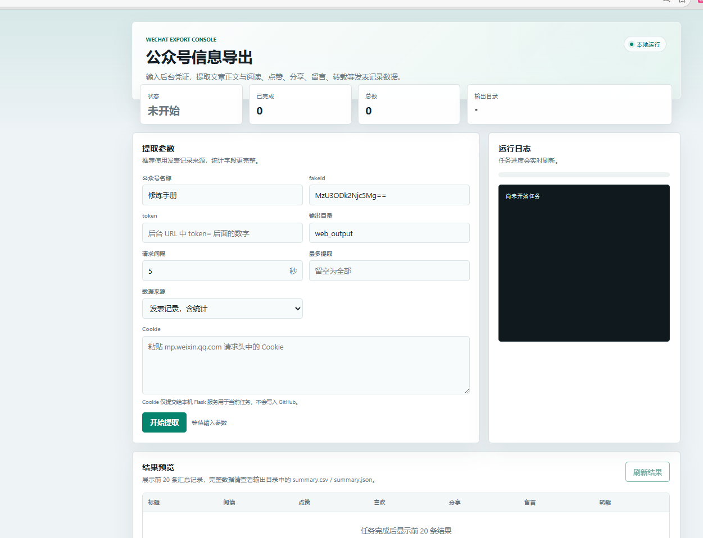

# WeChat Public Account Article Exporter

导出微信公众号文章正文和后台发表记录中的统计数据，并保存为 Markdown、CSV 和 JSON。

本项目最初用于导出公众号「张大刀修炼手册」的发表记录，但脚本也可以用于其他微信公众号后台账号可访问的文章。

## 可以导出什么

- 文章标题、作者、发布时间、原文链接
- 文章正文 Markdown
- 后台「发表记录」页面里的统计字段，例如：
  - `read_num`：阅读量
  - `old_like_num`：点赞/在看类计数
  - `like_num`：喜欢/爱心类计数
  - `share_num`：分享/转发量
  - `comment_num`：留言数
  - `total_comment_count_contains_reply`：留言含回复数
  - `reprint_num`：转载量

注意：脚本需要你自己的微信公众号后台登录态 Cookie 和后台 URL 里的 `token`。请不要把 `cookie.txt` 上传到 GitHub。

## 免责声明

本项目仅用于学习、研究和对本人拥有管理权限或已获得明确授权的微信公众号内容进行备份、整理与数据分析。使用者应自行确保使用行为符合相关法律法规、微信公众平台服务协议、数据安全要求以及目标账号的授权范围。

请勿将本工具用于未授权的数据抓取、批量采集、商业转售、侵犯他人版权或隐私、绕过平台访问控制、规避频率限制等用途。因使用本工具产生的账号风险、平台限制、数据泄露、版权纠纷或其他法律责任，均由使用者自行承担。

`cookie.txt`、`token` 等登录凭证具有敏感性，请妥善保管，切勿提交到 GitHub、公开分享或发送给不可信第三方。

## 示例结果

仓库中的 `output_publish_check/` 是一次示例运行结果，包含：

- `output_publish_check/articles/*.md`
- `output_publish_check/summary.csv`
- `output_publish_check/summary.json`

最后实际运行生成的结果目录也可以指定为 `output_publish_check`：

```powershell
python .\wechat_public_account_exporter.py account --account "张大刀修炼手册" --fakeid "MzU3ODk2Njc5Mg==" --cookie-file .\cookie.txt --token "你的token" --output .\output_publish_check --sleep 5
```

如果不想覆盖示例结果，可以把 `--output` 改成其他目录，例如 `.\output`。

## 安装依赖

```powershell
python -m pip install -r requirements.txt
```

## 启动前端页面

本项目提供一个本地 Web 页面，可以在浏览器中填写公众号名称、fakeid、token、Cookie、输出目录等参数，然后启动提取任务并在页面上查看进度和结果预览。

前端界面预览：



页面主要包含：

- 顶部状态区：展示任务状态、已完成数量、总数和输出目录。
- 提取参数区：填写公众号名称、fakeid、token、输出目录、请求间隔、最多提取数量、数据来源和 Cookie。
- 运行日志区：实时展示任务启动、请求、导出、异常等运行日志。
- 结果预览区：任务完成后读取导出目录中的 `summary.csv` / `summary.json`，展示前 20 条汇总记录。

```powershell
python .\web_app.py
```

启动后访问：

```text
http://127.0.0.1:7860
```

页面中的 Cookie 只会提交给本机运行的 Flask 服务用于本次导出任务，不会写入 GitHub。请仍然注意不要在公共网络或不可信机器上运行。

## Windows exe 版本

仓库的 `release/` 目录提供了打包好的 Windows 可执行文件：

- `release/GZHInformationExporter.exe`
- `release/README-windows.md`

下载后双击 `GZHInformationExporter.exe` 即可启动本地服务。程序会自动打开浏览器访问：

```text
http://127.0.0.1:7860
```

使用时保持 exe 的命令行窗口不要关闭；关闭窗口即停止本地服务。

## 获取 Cookie、token 和 fakeid

这些信息都来自你自己已登录的微信公众平台后台。它们属于敏感登录凭证或账号内部标识，请只在本机使用，不要上传到 GitHub，也不要公开分享。

### 获取 Cookie

1. 使用浏览器登录微信公众平台：`https://mp.weixin.qq.com/`
2. 登录成功后停留在公众号后台任意页面。
3. 按 `F12` 打开浏览器开发者工具，进入 `Network / 网络` 面板。
4. 刷新后台页面。
5. 在网络请求列表中点开任意 `mp.weixin.qq.com` 请求，例如 `home`、`appmsgpublish`、`cgi-bin/*` 等。
6. 找到 `Headers / 标头` 里的 `Request Headers / 请求标头`。
7. 复制完整的 `Cookie` 字段内容，并保存到项目根目录的 `cookie.txt`。

`cookie.txt` 中只需要放 Cookie 内容本身，例如：

```text
ua_id=...; wxuin=...; uuid=...; ticket=...; cert=...; slave_sid=...
```

### 获取 token

登录公众号后台后，浏览器地址栏通常会出现类似下面的 URL：

```text
https://mp.weixin.qq.com/cgi-bin/home?t=home/index&lang=zh_CN&token=123456789
```

其中 `token=` 后面的数字就是要填写的 token。以上例子中 token 是：

```text
123456789
```

如果当前页面地址栏没有 token，可以在后台点击「内容与互动」「发表记录」「草稿箱」等页面，或在开发者工具的网络请求中查看请求 URL，通常也能看到 `token=数字`。

### 获取 fakeid

`fakeid` 是微信公众号后台内部使用的账号标识，导出指定公众号时建议填写它，避免只按名称搜索时匹配到错误账号。

方式一：从后台搜索接口获取。

1. 登录微信公众平台后台，并确保 Cookie 和 token 有效。
2. 打开浏览器开发者工具，进入 `Network / 网络` 面板。
3. 在后台中搜索或选择目标公众号相关内容。
4. 在网络请求中查找包含 `searchbiz`、`appmsg`、`fakeid` 等关键词的请求。
5. 点开请求或响应内容，搜索 `fakeid`，复制对应值。

方式二：使用本项目脚本按公众号名称查询。

```powershell
python .\wechat_public_account_exporter.py search --account "公众号名称" --cookie-file .\cookie.txt --token "你的token"
```

如果搜索成功，输出结果中会包含类似：

```text
fakeid: MzU3ODk2Njc5Mg==
```

之后导出时把它传给 `--fakeid`：

```powershell
python .\wechat_public_account_exporter.py account --account "公众号名称" --fakeid "MzU3ODk2Njc5Mg==" --cookie-file .\cookie.txt --token "你的token" --output .\output_publish_check --sleep 5
```

如果脚本搜索不到 fakeid，通常是 Cookie 失效、token 不匹配、账号没有访问权限，或触发了平台频控。可以重新登录后台、更新 `cookie.txt` 和 token 后再试。

## 按公众号后台发表记录导出

推荐使用 `publish` 来源，这是默认模式，会从后台「发表记录」页面读取阅读量、点赞量、分享量、转载量等统计数据：

```powershell
python .\wechat_public_account_exporter.py account --account "张大刀修炼手册" --fakeid "MzU3ODk2Njc5Mg==" --cookie-file .\cookie.txt --token "你的token" --output .\output_publish_check --sleep 5
```

参数说明：

- `--account`：公众号名称。
- `--fakeid`：公众号后台 fakeid。已知时建议传入，避免搜索接口匹配错误。
- `--cookie-file`：保存 Cookie 的文件。
- `--token`：微信公众号后台 URL 中的 token。
- `--output`：导出目录。
- `--sleep`：请求间隔，建议 5 秒或更长，避免频控。

## 按文章链接列表导出

把文章链接逐行放进 `article_urls.txt`，然后运行：

```powershell
python .\wechat_public_account_exporter.py urls --input .\article_urls.txt --cookie-file .\cookie.txt --output .\output
```

这种方式主要用于已有文章链接时导出正文。统计数据不如后台发表记录来源稳定。

## 输出结构

```text
output_publish_check/
  articles/
    0001 标题.md
  summary.csv
  summary.json
```

每篇 Markdown 文件的 front matter 中会包含文章元数据和统计字段；`summary.csv` / `summary.json` 适合后续做表格分析。
